## Neural Network From Scratch

------

Problem Set:

|           |      | Inputs |      | Outputs |
| :-------: | :--: | :----: | :--: | :-----: |
| Example 1 |  0   |   0    |  1   |    0    |
| Example 2 |  1   |   1    |  1   |    1    |
| Example 3 |  1   |   0    |  1   |    1    |
| Example 4 |  0   |   1    |  1   |    0    |

|       |      | Inputs |      | Outputs |
| :---: | :--: | :----: | :--: | :-----: |
| New S |  1   |   0    |  0   |    ?    |

What should the new output be? 

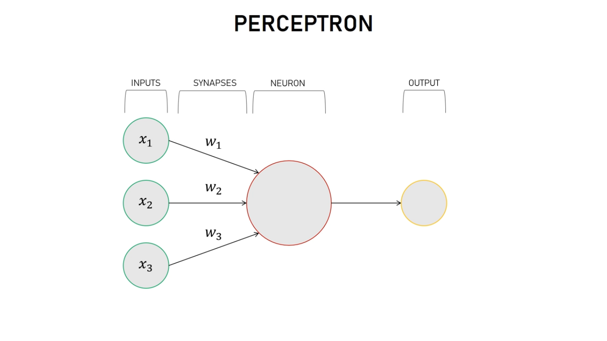

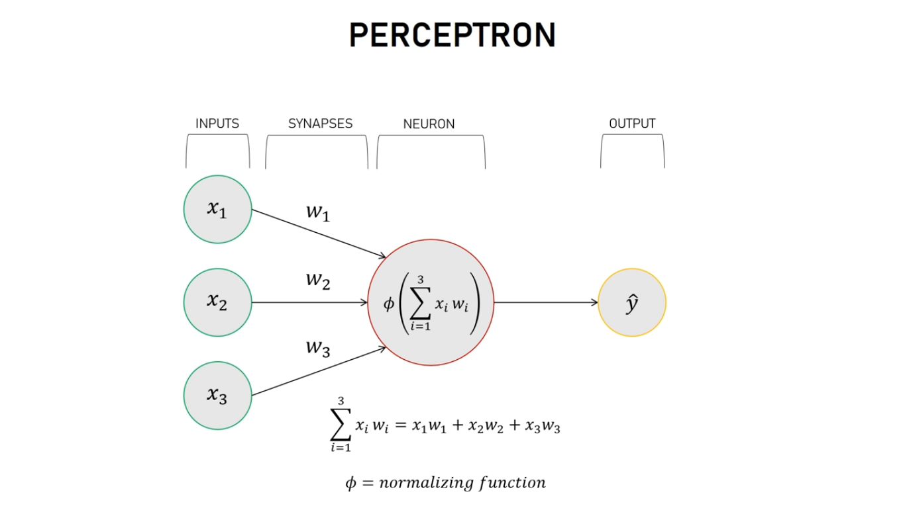

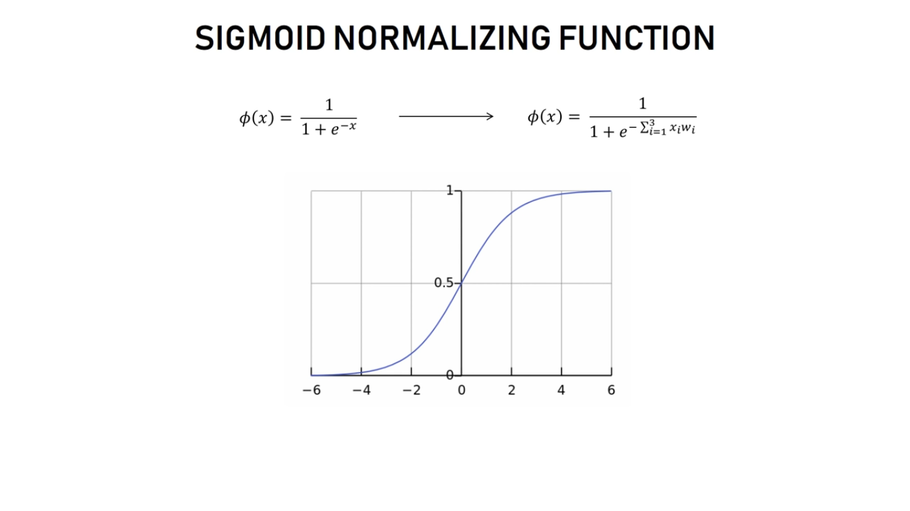

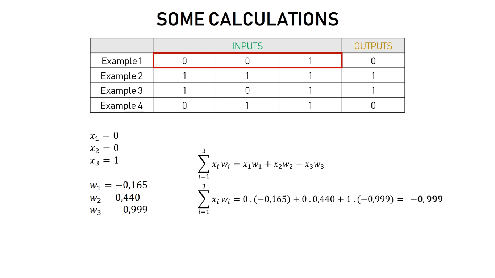

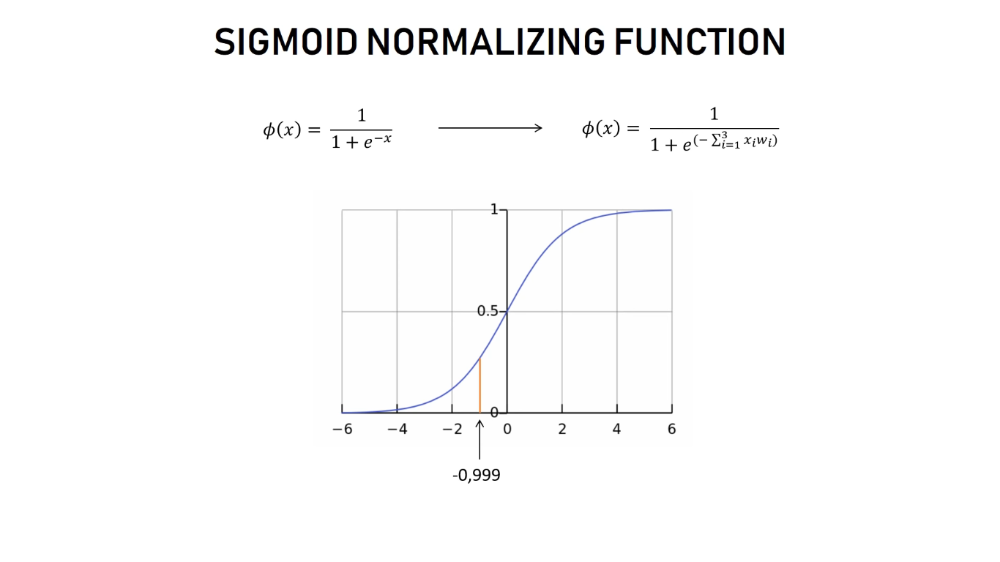

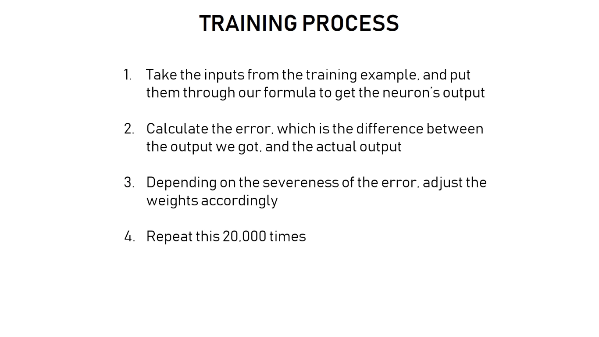

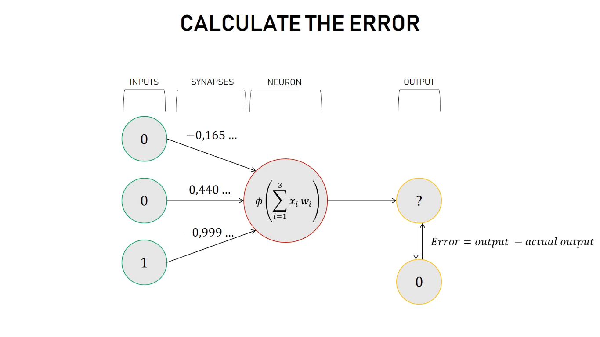

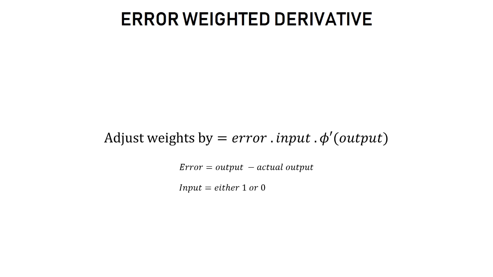

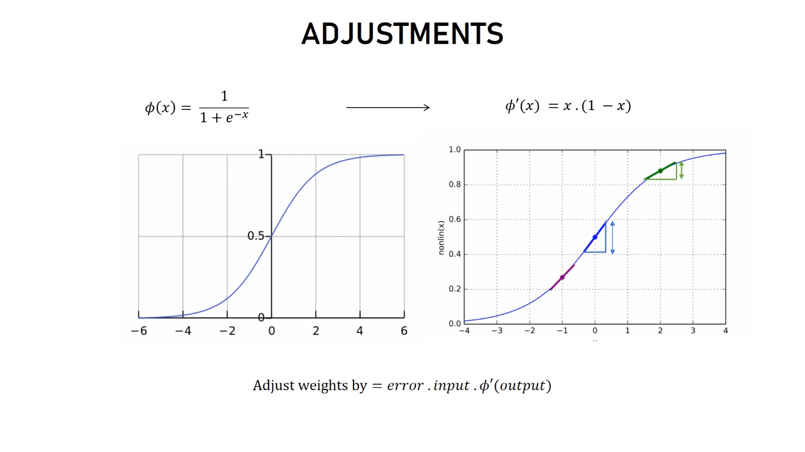

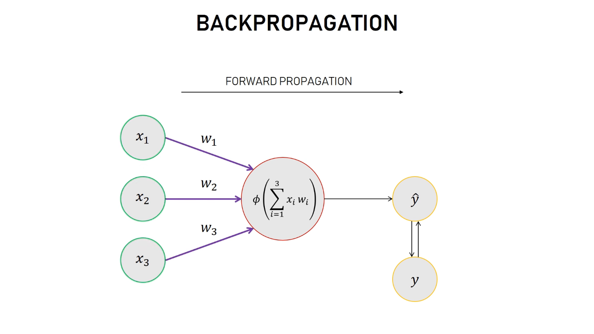

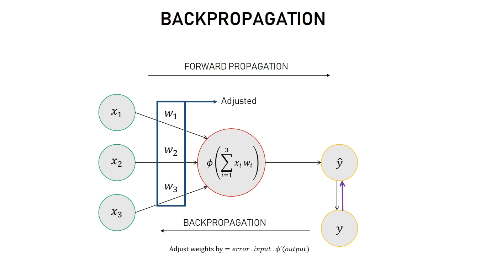

